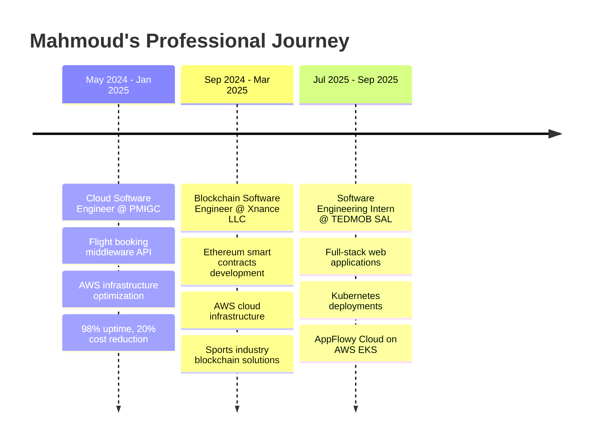

# Hi there, I'm Mahmoud Kebbi! 👋

<div align="center">
  
</div>

<div align="center">
  
[](https://www.linkedin.com/in/mahmoud-kebbi)
[](mailto:mahmoud.kebbi180@gmail.com)
[]()

</div>

---

## 🚀 About Me

```yaml
name: Mahmoud Kebbi
located_in: Beirut, Lebanon
current_job: Junior DevOps Engineer
education: Computer Engineering @ Lebanese American University

fields_of_interests:
  - Cloud Computing & Infrastructure
  - Blockchain & Smart Contracts
  - DevOps & Automation
  - Microservices Architecture
  
currently_learning: 
  - Advanced Kubernetes Orchestration
  - Web3 Development
  - Infrastructure as Code
  
````

---

## 🛠️ Tech Stack & Skills

### 💼 Core Skills

<div align="left">
  
  
  
  
  
  
  
  
  
</div>

### 💻 Programming Languages

<div align="left">
  
  
  
  
  
  
  
  
</div>

### 🛠️ Tools & Frameworks

<div align="left">
  
  
  
  
  
  
  
  
  
  
  
  
  
  
  
  
  
  
</div>

---

## 📊 GitHub Analytics

<div align="center">

<!-- Animated GitHub Stats -->

[](https://git.io/streak-stats)


</div>

<!-- GitHub Activity Graph -->

<div align="center">
  
</div>

<!-- Streak Stats -->

<div align="center">
  
</div>

---

## 🏆 Achievements & Certifications

<div align="center">

[]()
[]()
[]()
[]()
[]()
[]()
[]()

</div>

<div align="center">

<!-- Interactive Trophy Display -->


<!-- GitHub Contribution Metrics -->

<table align="center">
<tr border="none">
<td width="50%" align="center">

**🎯 Contribution Stats**

  

</td>
<td width="50%" align="center">

**⚡ Performance Metrics**


</td>
</tr>
</table>

<!-- Interactive Buttons -->

<details>
<summary>🎮 Developer Dashboard</summary>

### 💻 Real-time Coding Stats

```yaml
⏰ Active Hours: Peak performance 14:00-22:00 GMT+3
🔥 Current Streak: Building consistently  
💡 Most Used Language: JavaScript/Python
🎯 Weekly Goal: 10+ commits
📈 Growth Focus: Cloud-native & Blockchain
```

### 🌟 Achievement Unlocked

<div align="center">

[](https://holopin.io/@mahmoudkebbi)

</div>

</details>

<!-- Dynamic Stats Cards -->

<div align="center">
  
</div>

</div>

---

## 💼 Professional Experience Timeline



---

## 🎯 Featured Projects

### 🔋 [Peer-to-Peer Energy Trading Platform](https://github.com/MahmoudKebbi)

**Tech Stack:** `AWS` `Terraform` `Solidity` `Ethereum` `Express.js` `Python`

* ⚡ 90% reduction in environment setup time with Terraform
* 🚀 Backend scaling to 1,000+ requests/second
* ⛓️ Smart contracts for automated energy trading
* 💬 Real-time chat for trade negotiations

### 🤖 [Programmable Matter Simulation](https://github.com/MahmoudKebbi)

**Tech Stack:** `Python` `Pygame` `Cython`

* 🎯 A* pathfinding for autonomous unit coordination
* ⚡ 0.8-second average reconfiguration times
* 🎨 Interactive visualization with Pygame
* 🔧 Cython optimization for performance

### 🏓 [Table Tennis Club Management System](https://github.com/MahmoudKebbi)

**Tech Stack:** `React` `Redux Toolkit` `TailwindCSS` `Firebase`

* 📅 Real-time table booking system
* 👥 Member management with role-based access
* 📊 Admin dashboards and analytics
* 🔐 Firebase authentication integration

---

## 🎨 GitHub Activity

<!-- Interactive Contribution Calendar -->

<div align="center">
  
</div>

### 📊 Advanced Analytics Dashboard

<details>
<summary>📈 Click to expand detailed GitHub metrics</summary>
<br>

<!-- Detailed Language Stats -->

<div align="center">
  
</div>

<!-- Wakatime Stats -->

<div align="center">
  
</div>

<!-- GitHub Metrics -->

<div align="center">
  
</div>

</details>

---

## 🌟 What I'm Working On

<div align="center">

**🔭 Current Focus:**

* Building scalable microservices architectures
* Developing decentralized applications (dApps)
* Contributing to open-source DevOps tools

**🌱 Learning:**

* Advanced Kubernetes patterns
* Multi-cloud deployment strategies
* Zero-knowledge proofs in blockchain

**👯 Looking to Collaborate:**

* Cloud-native applications
* Blockchain infrastructure projects
* DevOps automation tools

</div>

---

## 🏆 Sports & Community

<div align="center">

🏓 **Table Tennis Enthusiast**

* Competitive player at Al Riyadi Club Beirut
* Founder & Head Coach at IAR Association Table Tennis Club
* Building community through sports and coaching

</div>

---

## 📫 Let's Connect!

<div align="center">

I'm always excited to collaborate on innovative projects and discuss the latest in DevOps, blockchain, and cloud technologies!

[](https://www.linkedin.com/in/mahmoud-kebbi)
[](mailto:mahmoud.kebbi180@gmail.com)

---

<div align="center">
  
</div>

**"Building the future, one commit at a time"** 🚀

</div>
```

